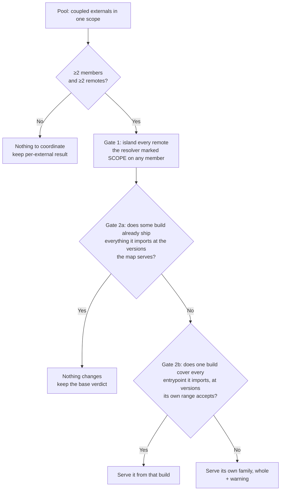

# Dependency Pooling

> Why a shared dependency family can end up assembled from builds that never shipped together, what pooling guarantees instead, and what that guarantee costs.

The [Version Resolver](version-resolver.md) resolves every shared external **independently**. That is the right default — it minimizes downloads, and for a flat dependency like `lodash` there is nothing to coordinate. But packages that ship as a **family** are not independent: `@angular/core` and `@angular/router`, `react` and `react-dom`, your own `@acme/ui` and `@acme/tokens`. Resolve those one at a time and a remote can end up running a combination nobody ever built.

**Pooling** is the opt-in feature that prevents that. It groups coupled externals and makes each remote take the whole group from a single build — either a shared one that covers it, or its own.

> **The promise.** Within a pool, every member a remote runs comes from a build that shipped them together.

## The problem, concretely

### 1. A family split across two versions

Three remotes share `@acme/ui` and `@acme/tokens`:

| Remote | `@acme/ui` | `@acme/tokens` |
| --- | --- | --- |
| mfe-a | 3.2.0 | 3.2.0 |
| mfe-b | 3.4.0 | 3.4.0 |
| mfe-c | 3.4.0 | 3.2.0 |

Every declared range is `^3.0.0`, so everything is "compatible" and the resolver dedups happily. It picks a winner per package, independently — and the winners can come from different remotes:

```json
{
  "imports": {
    "@acme/ui":     "https://mfe-b.example.org/acme-ui-3.4.0.js",
    "@acme/tokens": "https://mfe-a.example.org/acme-tokens-3.2.0.js"
  }
}
```

Now **every** remote runs `ui@3.4.0` beside `tokens@3.2.0` — a pair that exists in no repository, no CI run, and no test suite. It usually works. When it doesn't, the failure surfaces as a missing export or a subtly wrong theme token, far from the version metadata that caused it.

The root cause is that declared ranges **under-state real coupling**. Angular publishes `^22.0.0` on its inter-package dependencies while `@angular/router@22.1.0` genuinely requires `@angular/core@22.1.0`. The remote entry cannot tell the orchestrator that; the range says the pair is fine.

### 2. Transitive coupling through a shared intermediary

The sharper hazard. A design system `@design-system/ui` is compiled against `@framework/core@15` and shared from mfe-A. mfe-B is on `@framework/core@16` and consumes that shared design system.

```
mfe-B  →  @framework/core@16          (its own)
       →  @design-system/ui  (shared, from mfe-A)
            →  @framework/core@15     (dragged in)
```

mfe-B now loads **two framework runtimes**. Two DI containers that cannot see each other, two copies of module-level state, two `instanceof` identities. No version range anywhere in the portfolio is violated — the design system and the framework are different packages, resolved in different competitions.

## Do you need it?

Pooling is inert until you turn it on. Reach for it when:

- **Yes** — you share a package family published from one monorepo (`@angular/*`, `@acme/*`) across remotes that **deploy independently**. This is the case it was built for: independent deploys are exactly what lets versions drift apart between members.
- **Yes** — you share an unscoped lockstep pair (`react` + `react-dom`, `vue` + `vue-router`). Auto-pooling won't see it, but a [`pool` tag](#2-a-remote-declared-pool-tag) will.
- **Yes** — you share a design system or SDK that is itself compiled against a shared framework. That is the transitive case above, and only a tag can express it.
- **Probably not** — all your remotes build from one repo at one commit and deploy in lockstep. They already agree; pooling will find nothing to do and cost nothing, but it is not solving a problem you have.
- **No** — you share only flat, independent libraries. There is no family to keep coherent.

Symptoms worth checking against: two instances of a framework singleton, `instanceof` failing across an MFE boundary, a component library reading `undefined` from a peer's module state, or an import map where two members of one npm scope resolve to different remotes.

## Enabling pooling

An external joins a pool in one of two ways. Both can be used together.

### 1. Auto, by npm scope

```ts
await initFederation(manifest, {
  feature: { useAutoExternalPooling: true },
});
```

Scoped packages are grouped by their npm scope — `@framework/core` and `@framework/common` land in pool `framework`. Unscoped packages (`utils`, `tslib`, `react`) are never auto-pooled.

The grouping is contributed **per remote**: a pool forms only once some remote declares members from both sides. Two remotes that share no member never pool together — and need not, since neither is in a position to run an incoherent pair.

### 2. A remote-declared `pool` tag

A remote sets an optional `pool` on a shared package in its `federation.config.mjs`. It mirrors `shareScope` in shape, and Core (since v4.3) passes it through to `remoteEntry.json` untouched — the build itself does nothing with it. See [Core — per-package options](../core/sharing.md#per-package-options).

```js
// federation.config.mjs
import { withNativeFederation, share } from "@softarc/native-federation/config";

export default withNativeFederation({
  name: "team/mfe1",
  shared: share({
    react: { singleton: true, requiredVersion: "auto", pool: "react" },
    "react-dom": { singleton: true, requiredVersion: "auto", pool: "react" },
  }),
});
```

Which lands in the remote entry as:

```json
{
  "shared": [
    { "packageName": "react",     "singleton": true, "version": "18.3.1", "requiredVersion": "^18.0.0", "pool": "react" },
    { "packageName": "react-dom", "singleton": true, "version": "18.3.1", "requiredVersion": "^18.0.0", "pool": "react" }
  ]
}
```

A tag is **remote-local**: it groups only the externals that _one_ remote tags together. That is what makes it able to express a coupling auto-pooling cannot see — auto-pooling groups by npm scope and can never connect `@design-system/ui` to `@framework/core`, so the remote co-tags both.

A tag works whether or not `useAutoExternalPooling` is on.

### How membership is decided

**By shared members, not by name.** Pool identity is not a string remotes must agree on — it is the **connected component** of a graph. Each external is a node, joined by an edge to each `(remote, npm scope)` that declares it and to each `(remote, tag)` that declares it.

Because every edge is remote-local, two remotes' groups merge only when they **share a member**, never because they picked the same label. Drift is harmless: mfe-A calling a group `"framework"` and mfe-B calling it `"design-system"` still pool together if they overlap on one external, while two unrelated groups that happen to reuse a label stay separate.

One edge is **not** remote-local: a secondary entrypoint is always joined to its package (`@framework/core/testing` → `@framework/core`), whoever declares either. A package and its entrypoints are one artefact and must never be separable. On its own that edge forms no pool — with pooling inert it does nothing.

To pull a **cross-scope** sibling into a family, co-tag a bridge member: tagging both `@design-system/ui` and `@framework/core` with one label joins the two groups through the shared `@framework/core` node.

> A member carrying an explicit tag that pools with nothing is almost always a typo or a missing sibling, so it is logged. Auto-scope singletons are normal and stay silent.

## How pooling resolves

Pooling does **not** re-run the compatibility search, and it elects no versions of its own. The resolver has already, per member, picked a winning version (`share`) and marked every other copy `skip` (compatible) or `scope` (strict-incompatible) — so host precedence and `requiredVersion` acceptance are settled before pooling runs. Pooling grants no dedup the resolver did not. It only decides, **per remote**, whether that remote may _take_ the dedups it was granted.

The unit it reasons about is a **build**: one remote's whole set of `member → version`. A build is coherent by construction — those files were compiled and tested together. So the rule reads coverage and range acceptance only; it never reasons about how "close" two version numbers look. Version arithmetic cannot carry the promise: a minor line is a convention each vendor picks, two unrelated packages sharing one would be treated as coupled, and a family whose members version independently has no line to compare at all.

### Gate 1 — incompatibility (islanding)

A remote the resolver marked `scope` on **any** member of the pool is **islanded**: its entire family comes from its own build, with **no** dedup — not even on a member whose version matches the shared one.

That last part is the whole point, and the one thing the per-external resolver cannot do. Deduping the matching sibling is exactly what leaks a foreign build in through a shared intermediary.

### Gate 2 — provenance

For every remote gate 1 left alone, three questions, in this order:

1. **Is it already fine?** If some live build in the pool ships every specifier this remote imports at exactly the versions the import map already serves them at, nothing changes — it keeps resolving through the map as it stands. Its own build is the common case; the general form is what lets a remote sitting one patch below the shared set stay free rather than expensive. Asking coverage first instead would pin remotes that are already correct onto one build, for no gain in coherence and a real cost in downloads.
2. **Is there one covering build?** Otherwise the remote may dedup onto a **single** build that offers every entrypoint it imports, at versions its own `requiredVersion` accepts.
3. **Otherwise it serves its own family**, whole, from its own build — and says so with a warning, since this is the rule's main cost and nothing else would make it visible.



### The rules that fall out of it

**All-or-nothing per remote.** A remote that cannot take every member it consumes from one build serves its _whole_ family itself. One member at the remote's own version beside another from a foreign build at a different version is precisely the combination nothing compiled.

**A `skip` the resolver granted does not automatically survive.** The resolver marks a remote `skip` whenever its declared range accepts the shared version. This gate decides whether it may actually take that dedup — and where no build shipped the resulting combination, it may not.

**The consumer gives way, never the host.** Host precedence still decides the version: if the host ships `core@22.0.5`, the shared `core` is `22.0.5`, and no coverage question moves it. It does not follow that a remote shipping `core@22.1.0` beside `router@22.1.0` must accept that copy — that pair is a combination no build shipped, so the remote islands and pays the extra download while the host keeps its pin. Coherence costs the mixing remote a dedup, never the host its version. The host is never assigned somebody else's build either: it consumes exactly what it declares, so its family is its own build by construction, and it stays a candidate for everybody else.

**Assignment is per consumer, so one pool may run several builds.** Which build serves which remote is recorded per remote, not per version — two consumers of the same version can legitimately take different builds. Forcing a single build on the whole portfolio would cost more downloads and scope members that nothing required.

**Scoped-only members.** If every provider of a member was islanded away, that member has no coherent shared build left: its remaining copies fall to `scope`, it stops being shared, and a warning says so. An islanded remote contributes **no** build to the pool — not even for a member it is the sole provider of. Otherwise a previous-major remote correctly islanded on `@framework/core` would keep its `@framework/animations@21.2.18` globally shared beside `core@22.0.8`, and any remote consuming both loads a mismatched pair. Dropping the whole build is what keeps the shared set itself coherent.

**Entrypoint tears cannot happen inside a pool.** Pooling tests coverage **per specifier**, so a build can be the elected source of every _member_ of a pool and still fail on one secondary entrypoint. See [Entrypoint coverage and tearing](version-resolver.md#entrypoint-coverage-and-tearing) for the unpooled behaviour and the settings that govern it.

**Strict mode.** Under `strictExternalCompatibility` a gate-1 island throws — defensively, since a real incompatibility already threw in the resolver. A gate-2 self-serve does **not** throw: nothing about its versions is wrong, so a coverage gap must not turn a strict portfolio into a failure.

## What it costs

> **Pooling buys coherence, not downloads.** On every portfolio measured it left the download count unchanged or **increased** it. It never reduced it.

What it removes is the incoherence: a shared set spanning majors `{21, 22}` collapses to `{22}`, packages split across two versions disappear, and no remote is handed a family assembled from builds that never shipped it together.

| Portfolio | Effect |
| --- | --- |
| Seven-remote production capture | Unchanged in every measure — same downloads, same chunks, same shared versions, byte-identical import map. |
| Eleven-remote drifted portfolio | +23.6% downloads, nearly all of it the single remote that ships the widest family and can therefore be covered by nobody. |
| Warm init (nothing re-elected) | Zero. Pooling does no work and writes nothing. |

A coherent or lockstep portfolio — the overwhelmingly common case — pays nothing, because gate 2's first question answers "already fine" for every remote. Cost appears exactly where incoherence did.

The escape hatch is to **not pool that family** (auto-pooling off, or drop the `pool` tag) — not a per-portfolio tuning knob.

## Declaring the coupling you actually have

Pooling exists to compensate for information the remote entry does not carry. You can carry some of it yourself.

**Tighten ranges where the real coupling is tighter.** Write `~22.0.6` rather than `^22.0.0` when that is the truth. Gate 2 enforces coupling at every granularity anyway — patch included — so the outcome is the same either way. What changes is _which verdict you see_: a range violation is a version problem with a name, reported by the resolver, while a coverage self-serve is a statement about what nobody built.

**A `pool` tag is all-or-nothing per npm scope: tag the whole family, or none of it.** Tagging any member of a scope switches that remote's auto-pooling off for the **whole** scope, while the tag itself groups only what you actually tagged. Tag one `@framework/*` package and the rest of your `@framework` externals contribute nothing to the graph from your remote — they pool only if some other remote declares two of them untagged and holds the scope open. Partial tagging can therefore make coverage **worse** than not tagging at all, and it fails quietly: the members that fall out are still shared, just no longer coordinated with the family.

Two habits avoid it:

- If you tag, tag **every** member of that scope you declare, secondary entrypoints included. A build emitting flat entries makes this easy to get wrong — `@framework/core` and `@framework/core/primitives/di` are two externals, and tagging only the first leaves the second relying on the package edge rather than on your tag.
- Reach for a tag only to express a coupling auto-pooling **cannot see**: a cross-scope sibling, or an unscoped lockstep pair. Inside one npm scope, auto-pooling already has it, and a tag can only narrow what it covers.

**One remote declaring a tag is enough for the whole portfolio.** The tag is remote-local for _membership_ — it decides which externals form the pool — but the pool then operates on the whole shared external for each member: every version, every remote. Remotes that never declared a `pool` tag are still subject to the family's coherence rules for those packages. That is deliberate (one team can fix a portfolio it does not own), but worth knowing before adding a tag.

> A coupling **no single remote witnesses** — where no remote ships both members — cannot be expressed. This is rare, and by design: a portfolio where nothing brings the two together has nothing to make incoherent.

## Scope and dynamic init

Pooling applies to the **global scope** and to **named share scopes**. The [`strict` share scope](version-resolver.md#the-strict-share-scope) is never pooled — it exists precisely to let versions coexist.

It runs in both the initial pipeline and dynamic init (`initRemoteEntry`), and is gated on the resolver having re-elected something, so a warm init that adds no remotes does no pooling work at all. A pool is re-elected as a **unit**: the moment one member is dirty, all of them are, so a previous run's island can never outlive the condition that caused it.

Because the import map is immutable once committed, the dynamic pass is **additive** — it adjusts only the newly loaded remote and never retro-corrects committed ones. Both gates are mirrored, measured against what the **committed** map already publishes:

1. May the new remote resolve through the committed `imports` as they stand — did some build ship every specifier it imports at exactly the versions the map serves them at? Its own build counts, and so does a committed island's.
2. Otherwise, may it take a single committed build that covers every entrypoint it imports at versions it accepts? Candidates are tried cheapest first: a build the map already serves this pool from costs no download at all, then the host, whose build the browser has loaded anyway, then by name so the choice is reload-stable.
3. Otherwise it serves its own family, and says so.

Pool membership comes from the **committed record**, not from the entry in front of it, so a remote loaded at runtime is subject to every pool the portfolio has — including one another remote's `pool` tag formed, and a cross-scope bridge it declares nothing about itself. Without that, a remote loaded later is exactly the consumer that would bridge two builds the portfolio had deliberately pooled apart.

## Diagnostics

Everything pooling reports is at `warn` level or below, so `logLevel: 'warn'` is enough to see the costs:

```ts
await initFederation(manifest, {
  logLevel: "warn",
  logger: consoleLogger,
  feature: { useAutoExternalPooling: true },
});
```

| Level | Line | What it means |
| --- | --- | --- |
| `warn` | `'<remote>' is islanded: the resolver scoped its '<member>@<version>', so all N members it imports are scoped for it.` | **Gate 1.** That remote re-downloads the whole family. Align its version, or accept the cost. N counts what that remote imports, not the pool. |
| `warn` | `'<remote>' serves its own family: no shared build offers every entrypoint it imports at a version it accepts — '<gap>' is the gap, closest is '<build>'. All N members it imports are scoped for it.` | **Gate 2**, and the main cost of the promise. `<gap>` names the one thing the closest build fell short on — an entrypoint it does not carry, or a member at a version outside this remote's range. Closing that gap in **either** build recovers the dedup. |
| `warn` | `'<remote>' serves its own family: no committed build offers …` | The same finding on the dynamic-init path: the remote just loaded would have bridged builds that shipped none of each other's members. |
| `warn` | `'<member>' is scoped-only — no coherent shared build provides it; N remotes download their own copy.` | Sharing was possible and was lost. Counts only the copies that really self-serve. Suppressed when an island in the same pass already named the cause. |
| `debug` | `[pool:<name>] N members across M remotes, incompatible={…}` | Pool formation — the fastest way to confirm membership came out the way you intended. The pool is named after its smallest member, so the name is stable across reloads. |

**Reading them as a workflow.** A gate-2 warning is the actionable one: it names a specific gap in a specific build. Usually the fix is on the build side — either bump the lagging remote, or have the widest remote share the entrypoint it is missing — and the dedup comes back on the next deploy. A gate-1 warning is a genuine version conflict that pooling merely made expensive instead of silently wrong.

## See also

- [Version Resolver](version-resolver.md) — the resolution this feature layers on top of: share scopes, priority rules, `strictVersion`, and entrypoint coverage.
- [Configuration — features](configuration.md#features) — the `useAutoExternalPooling` flag in context.
- [Core — sharing dependencies](../core/sharing.md) — the build-side config that emits `shared` entries, including the `pool` field.
- [The orchestrator docs](https://github.com/native-federation/orchestrator/blob/main/docs/version-resolver.md#dependency-pooling) — the upstream chapter, including the internals and the measured captures.
