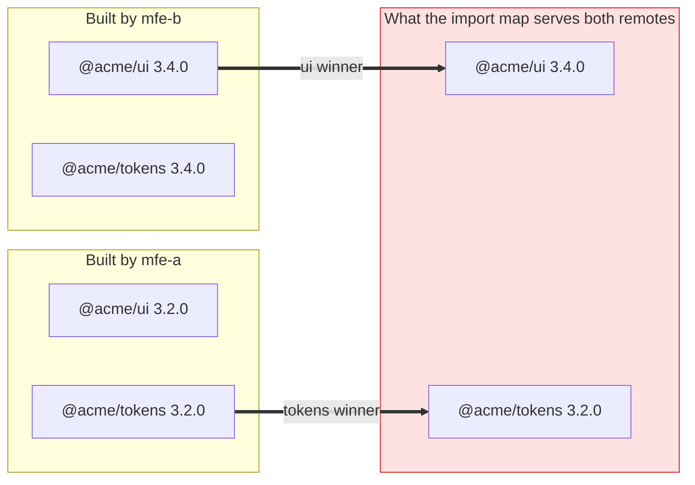
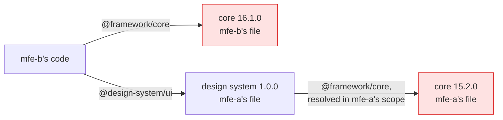
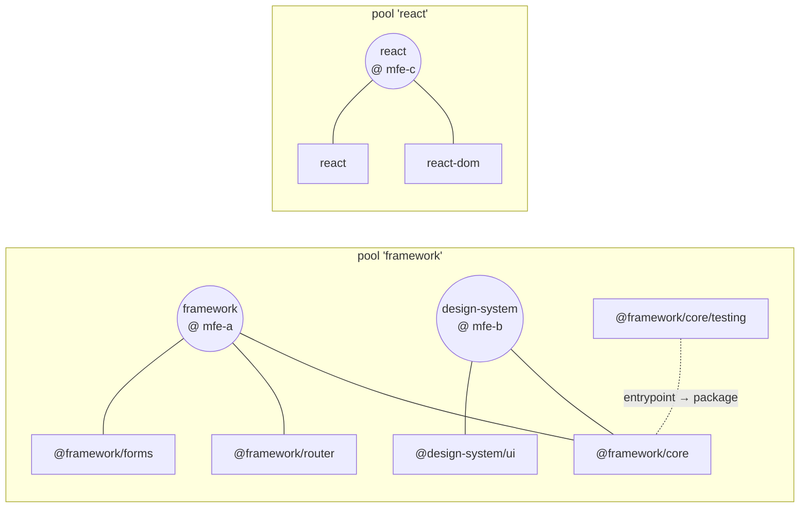
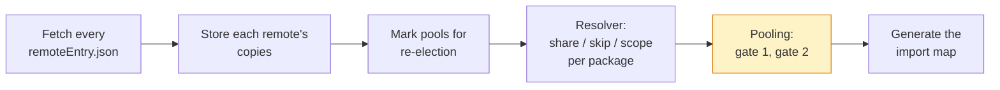
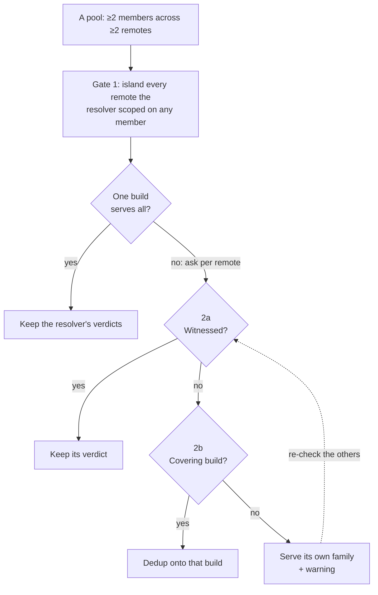
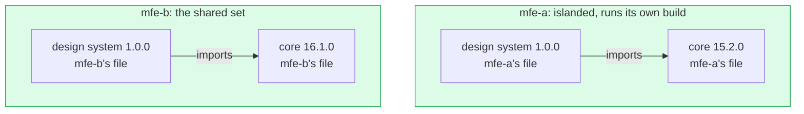
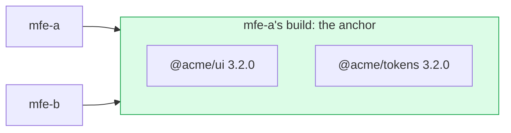
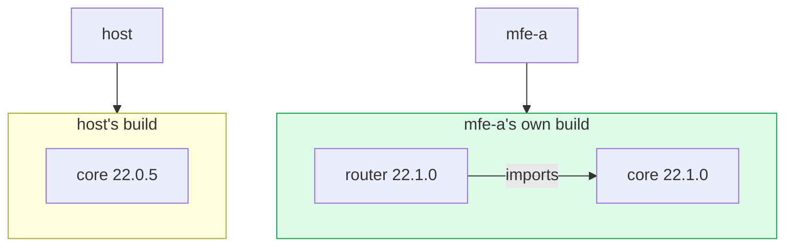
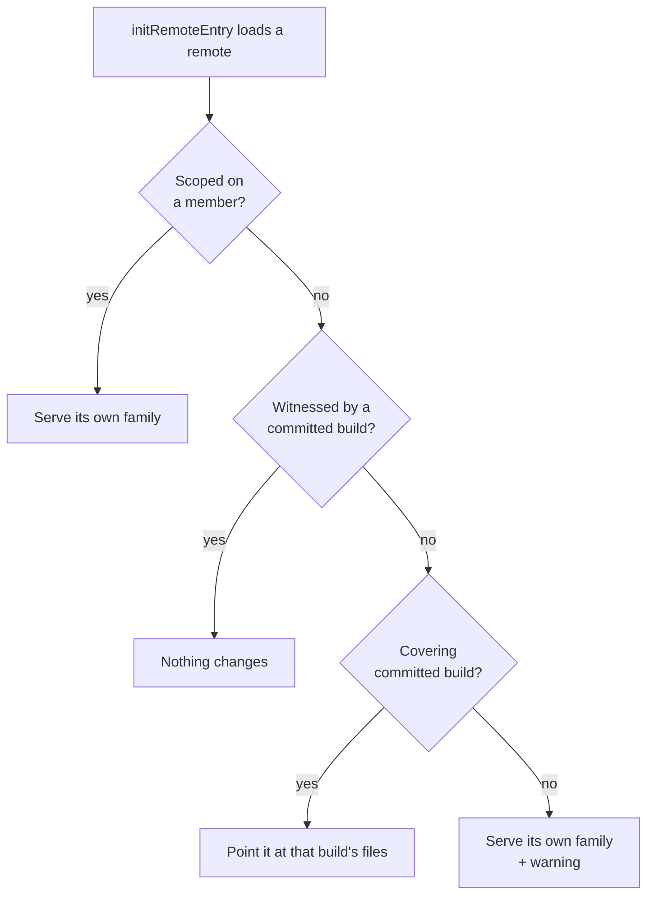

# Dependency Pooling

> Why a shared dependency family can end up assembled from builds that never shipped together, what pooling guarantees instead, and what that guarantee costs.

The [Version Resolver](version-resolver.md) resolves every shared external **independently**. That is the right default — it minimizes downloads, and for a flat dependency like `lodash` there is nothing to coordinate. But packages that ship as a **family** are not independent: `@angular/core` and `@angular/router`, `react` and `react-dom`, your own `@acme/ui` and `@acme/tokens`. Resolve those one at a time and a remote can end up running a combination nobody ever built.

**Pooling** is the opt-in feature that prevents that. You tag the packages that belong together, and the orchestrator makes each remote take that whole group from **one build** — a shared one that shipped exactly that combination, or its own.

> **The promise.** Within a pool, every member a remote runs comes from a build that shipped them together.

## The problem, step by step

Two things go wrong without pooling. Both examples below show what the resolver actually produces for these inputs.

### 1. A family split across two builds

Two remotes share a design-system family. mfe-a pins its tokens tightly:

| Remote | `@acme/ui` | `@acme/tokens` |
| --- | --- | --- |
| mfe-a | `3.2.0`, accepts `^3.0.0` | `3.2.0`, accepts `~3.2.0` (`strictVersion: true`) |
| mfe-b | `3.4.0`, accepts `^3.0.0` | `3.4.0`, accepts `^3.0.0` |

Each remote's build is fine on its own: its `ui` and `tokens` were compiled and tested together.

The resolver then picks a winner **per package**, each on its own:

- **`@acme/tokens` → `3.2.0`.** mfe-a's `~3.2.0` rejects `3.4.0`, while mfe-b's `^3.0.0` accepts `3.2.0`. Picking `3.2.0` lets both remotes dedup.
- **`@acme/ui` → `3.4.0`.** Both ranges accept both versions, so the tie goes to the newest.

Each choice is optimal on its own. Together they hand **both** remotes a pair that exists in no build:



It usually works. When it doesn't, the failure surfaces as a missing export or a subtly wrong theme token, far from the version metadata that caused it.

The root cause is that declared ranges **under-state real coupling**. Angular publishes `^22.0.0` on its inter-package dependencies while `@angular/router@22.1.0` genuinely requires `@angular/core@22.1.0`. The remote entry cannot tell the orchestrator that; the range says the pair is fine.

### 2. A second framework runtime through a shared intermediary

The sharper hazard. A design system is compiled against the framework, and both are shared:

| Remote | `@framework/core` | `@design-system/ui` |
| --- | --- | --- |
| mfe-a | `15.2.0`, accepts `^15.0.0` | `1.0.0` |
| mfe-b | `16.1.0`, accepts `^16.0.0` | `1.0.0` |

The two `core` versions are incompatible, so the resolver shares `16.1.0` and gives mfe-a its own `15.2.0` in mfe-a's scope. The design system is `1.0.0` on both sides, so it is shared — and it happens to be published from mfe-a's copy.

Import map scopes are chosen by the URL of the **importing file**. The shared design system lives under mfe-a's URL, so its own `import '@framework/core'` resolves in mfe-a's scope:



mfe-b now runs **two framework runtimes**: two DI containers that cannot see each other, two copies of module-level state, two `instanceof` identities. No declared range was violated. The design system and the framework are different packages, resolved in different competitions. Had the design system been published from mfe-b's copy instead, mfe-a would be the one running both runtimes.

## Do you need it?

Pooling is inert until a remote tags a family. Reach for it when:

- **Yes** — you share a package family published from one monorepo (`@angular/*`, `@acme/*`) across remotes that **deploy independently**. This is the case it was built for: independent deploys are exactly what lets versions drift apart between members.
- **Yes** — you share an unscoped lockstep pair (`react` + `react-dom`, `vue` + `vue-router`).
- **Yes** — you share a design system or SDK that is itself compiled against a shared framework. That is the second example above.
- **Probably not** — all your remotes build from one repo at one commit and deploy in lockstep. They already agree. Pooling will find nothing to do and cost nothing, but it solves a problem you don't have.
- **No** — you share only flat, independent libraries. There is no family to keep coherent.

Symptoms worth checking against: two instances of a framework singleton, `instanceof` failing across an MFE boundary, a component library reading `undefined` from a peer's module state, or an import map where two members of one family resolve to different remotes.

## Enabling pooling

An external joins a pool through an optional `pool` on a shared package in the remote's `federation.config.mjs`. It mirrors `shareScope` in shape. Core passes it through to `remoteEntry.json` untouched, and the build itself does nothing with it. See [Core — per-package options](../core/sharing.md#per-package-options).

> **Upgrading from 4.6.** Orchestrator 4.7.0 removed `feature.useAutoExternalPooling`, which grouped scoped packages by npm scope at runtime. Pools now form only from `pool` tags; to keep a scope pooled, tag its packages at build time.

```js
// federation.config.mjs
import { withNativeFederation, share } from "@softarc/native-federation/config";

export default withNativeFederation({
  name: "team/mfe1",
  shared: share({
    react: { singleton: true, requiredVersion: "auto", pool: "react" },
    "react-dom": { singleton: true, requiredVersion: "auto", pool: "react" },
  }),
});
```

Which lands in the remote entry as:

```json
{
  "shared": [
    { "packageName": "react",     "singleton": true, "version": "18.3.1", "requiredVersion": "^18.0.0", "pool": "react" },
    { "packageName": "react-dom", "singleton": true, "version": "18.3.1", "requiredVersion": "^18.0.0", "pool": "react" }
  ]
}
```

Tagging every package of an npm scope with that scope (`@framework/core`, `@framework/common` → `framework`) is the usual way to pool a framework family. The design-system hazard is covered by tagging **across** scopes: give `@design-system/ui` and `@framework/core` the same tag.

## How a pool is formed

Pool identity is not a string that remotes must agree on. The orchestrator draws a graph and each **connected group** is a pool:

- every shared external is a node;
- every `pool` tag is a node **per remote** — mfe-a's `framework` and mfe-b's `framework` are two different nodes;
- a remote that tags an external links the two;
- a secondary entrypoint is always linked to its package (`@framework/core/testing` → `@framework/core`), tagged or not.

For example, mfe-a tags three framework packages `framework`, mfe-b tags its design system together with `@framework/core` as `design-system`, and mfe-c tags `react` and `react-dom` as `react`:



Three consequences follow from the picture:

- **Groups merge through a shared member, never through a shared label.** mfe-a's `framework` group and mfe-b's `design-system` group become one pool because both contain `@framework/core`. Two unrelated groups that happen to reuse a label stay separate. That is why the design system above ends up coordinated with the framework: `@framework/core` is the **bridge member**.
- **A pool needs two sides.** It forms only once some remote declares members from both sides. Two remotes that share no member never pool together, and need not: neither is in a position to run an incoherent pair.
- **Entrypoints follow their package.** `@framework/core/testing` carries no tag of its own and still joins, because a package and its entrypoints are one artefact. On its own, with no tag in the group, that link forms no pool.

> A member carrying a tag that pools with nothing is almost always a typo or a missing sibling, so it is logged as a warning.

**A pool is named after the tag most of its copies declare**, with ties broken alphabetically. The pool above has three `framework` links against two `design-system` ones, so it is named `framework`. Because tags are remote-local, two unrelated pools can end up with the same tag: the one whose smallest member sorts first keeps it, and the others are suffixed `framework~2`, `framework~3`. The name is derived, not declared — a new remote that merges two pools renames one of them — so treat it as a label to group by, not a key to keep.

## Where pooling runs

Pooling is a step in the init pipeline, between the resolver and the import map:



- **Mark pools for re-election.** A pool is one unit of state: the moment one member changed (a remote was added, redeployed or removed), every member is re-elected. That way a verdict pooling made for an earlier portfolio can never outlive the condition that caused it.
- **The resolver** has already decided, per package, which version is shared (`share`), which copies dedup onto it (`skip`) and which must keep their own file (`scope`). Host precedence and `requiredVersion` acceptance are settled here.
- **Pooling** re-runs no compatibility search and elects no versions of its own. It only decides, **per remote**, whether that remote may actually _take_ the dedups the resolver granted it.

When nothing was re-elected — a warm init with no new remotes — pooling does no work at all.

## How pooling decides

The unit pooling reasons about is a **build**: one remote's whole set of `member → version`. A build is coherent by construction, because those files were compiled and tested together. So pooling only ever asks "did some build ship this combination?" and "does this build cover what that remote imports, at versions its range accepts?". It never judges how "close" two version numbers look. Version arithmetic cannot carry the promise: a minor line is a convention each vendor picks, two unrelated packages sharing one would be treated as coupled, and a family whose members version independently has no line to compare at all.

For each pool it runs these steps:



After gate 1 comes a shortcut: if one build serves every member and every entrypoint the other remotes import, there is nothing left to decide. That is the common case — in a coherent or lockstep portfolio nobody is islanded, one build serves the whole pool, and pooling writes nothing. The rest is easiest to follow through the two examples from the start of this page, plus a third.

### Gate 1 — islanding an incompatible remote

A remote the resolver marked `scope` on **any** member of the pool is **islanded**: its entire family comes from its own build, with **no** dedup — not even on a member whose version matches the shared one.

That last part is the whole point, and the one thing the per-package resolver cannot do. In the [second example](#2-a-second-framework-runtime-through-a-shared-intermediary), mfe-a's `core@15.2.0` is scoped, so pooling islands mfe-a. Its `@design-system/ui@1.0.0` is scoped too, even though that version matches the shared one exactly, and the shared design system is now published from mfe-b's copy:



```json
{
  "imports": {
    "@framework/core": "http://mfe-b/@framework/core.js",
    "@design-system/ui": "http://mfe-b/@design-system/ui.js"
  },
  "scopes": {
    "http://mfe-a/": {
      "@framework/core": "http://mfe-a/@framework/core.js",
      "@design-system/ui": "http://mfe-a/@design-system/ui.js"
    }
  }
}
```

Each remote runs one framework runtime. mfe-a pays one extra download for the design system, and the log says so:

```
[__GLOBAL__][pool:framework] 'mfe-a' is islanded: the resolver scoped its '@framework/core@15.2.0', so all 2 members it imports are scoped for it.
```

An islanded remote also offers **no** build to the others — not even for a member it is the only provider of. Otherwise a previous-major remote correctly islanded on `@framework/core` would keep its `@framework/animations@21.2.18` globally shared beside `core@22.0.8`, and any remote consuming both would load a mismatched pair. If that leaves a member with no provider at all, the member stops being shared: every remote that imports it serves its own copy.

### Gate 2 — every other remote

A split family contains no incompatibility, so gate 1 never fires on it. Gate 2 asks three questions of every remote gate 1 left alone, **in this order**.

**a. Is it already fine?** If some build in the pool ships every entrypoint this remote imports at exactly the versions the import map already serves, nothing changes. Its own build is the common case. The general form is what keeps a remote sitting one patch below the shared set free rather than expensive. This question comes first because asking for a covering build first would pin remotes that are already correct onto one build, for no gain in coherence and a real cost in downloads.

In the [first example](#1-a-family-split-across-two-builds), add a third remote, mfe-c, whose build happens to be `ui@3.4.0` with `tokens@3.2.0`. The map serves exactly that pair, and mfe-c's build shipped it, so every remote is witnessed and pooling changes nothing. The pair _was_ built and tested together — by mfe-c.

**b. Is there one build that covers it?** Otherwise the remote may dedup onto a **single** build that offers every entrypoint it imports, at versions its own `requiredVersion` accepts.

Without mfe-c, neither remote is witnessed: the map serves `ui@3.4.0` with `tokens@3.2.0`, and neither build shipped that pair. So pooling looks for a covering build:

| Can… serve… | Coverage | Versions | Result |
| --- | --- | --- | --- |
| mfe-b's build serve mfe-a? | ✓ both packages | ✗ mfe-a's `~3.2.0` rejects `tokens@3.4.0` | No |
| mfe-a's build serve mfe-b? | ✓ both packages | ✓ mfe-b's `^3.0.0` accepts both `3.2.0` copies | **Yes** |

mfe-a's build becomes the **anchor**. Both remotes now run it:



```json
{
  "imports": {
    "@acme/tokens": "http://mfe-a/@acme/tokens.js"
  },
  "scopes": {
    "http://mfe-a/": { "@acme/ui": "http://mfe-a/@acme/ui.js" },
    "http://mfe-b/": { "@acme/ui": "http://mfe-a/@acme/ui.js" }
  }
}
```

Three things are worth noticing in this result:

- **The elected tag moved backwards.** The resolver picked `ui@3.4.0`, yet everyone runs `3.2.0`. Pooling never re-elects a winner; it changes which _file_ a remote resolves, and both ranges accept `3.2.0`.
- **`@acme/ui` left the global `imports`.** The only copy of `3.4.0` was mfe-b's, and mfe-b now runs somebody else's build. A file is published globally only by a remote that runs it itself, so each consumer gets `ui` through its own scope entry instead.
- **It cost nothing.** Two files were downloaded before, and two are downloaded now.

When several remotes need a build, the anchors are picked greedily and deterministically. The host goes first, because its build is loaded anyway. After that, the build that can serve the most remotes still waiting wins, with ties broken by arrival order, then by name. An anchor always runs its own build, so nobody dedups onto a remote that is itself deduping onto somebody else. One pool can end up with several anchors: which build serves which remote is recorded per remote, and forcing a single build on the whole portfolio would cost more downloads.

**c. Otherwise it serves its own family**, whole, from its own build — and says so with a warning, since this is the rule's main cost and nothing else would make it visible.

The third example is a host that pins an older framework, and a remote that is one minor ahead:

| Participant | `@framework/core` | `@framework/router` |
| --- | --- | --- |
| host | `22.0.5` | — |
| mfe-a | `22.1.0`, accepts `^22.0.0` | `22.1.0`, accepts `^22.0.0` |

Host precedence makes `core@22.0.5` the shared version, and mfe-a's range accepts it, so the resolver lets mfe-a dedup. Without pooling mfe-a runs the host's `core@22.0.5` beside its own `router@22.1.0` — and `router@22.1.0` was built against `core@22.1.0`.

With pooling, mfe-a is not witnessed: no build ships `core@22.0.5` with `router@22.1.0`. The only other build is the host's, and it has no `router` at all. So mfe-a serves its own family:



```
[__GLOBAL__][pool:framework] 'mfe-a' serves its own family: no shared build offers every entrypoint it imports at a version it accepts — '@framework/router' is the gap, closest is 'host'. All 2 members it imports are scoped for it.
```

The warning names the gap and the closest build: if the host shared `@framework/router@22.0.5` too, mfe-a could dedup onto the host's build.

Serving its own family takes that build out of the pool for everyone else, which can leave another remote without a covering build. Gate 2 therefore repeats until nothing moves. Once it has settled, pooling checks the result one final time: every remote must resolve a combination that some single build shipped. No known portfolio reaches that check, but a remote that failed it would serve its own family too.

### The rules that fall out of it

**All-or-nothing per remote.** A remote that cannot take every member it imports from one build serves its _whole_ family itself. One member at the remote's own version beside another from a foreign build at a different version is precisely the combination nothing compiled.

**A `skip` the resolver granted does not automatically survive.** The resolver marks a remote `skip` whenever its declared range accepts the shared version. Gate 2 decides whether it may actually take that dedup — and where no build shipped the resulting combination, it may not.

**The consumer gives way, never the host.** Host precedence still decides the version, and no coverage question moves it — as in the third example, the mixing remote pays the extra download while the host keeps its pin. The host is never assigned somebody else's build either: it runs exactly what it declares, and stays a candidate anchor for everybody else.

**Coverage is per entrypoint.** Pooling compares the entrypoints each build carries, so a build can be the shared source of every _member_ of a pool and still fail on one secondary entrypoint. Inside a pool, a package therefore cannot be torn across two builds. See [Entrypoint coverage and tearing](version-resolver.md#entrypoint-coverage-and-tearing) for the unpooled behaviour and the settings that govern it.

**Strict mode.** Under `strictExternalCompatibility` a gate-1 island throws — defensively, since a real incompatibility already threw in the resolver. A gate-2 self-serve does **not** throw: nothing about its versions is wrong, so a coverage gap must not turn a strict portfolio into a failure.

## What it costs

> **Pooling buys coherence, not downloads.** On every portfolio measured it left the download count unchanged or **increased** it. It never reduced it.

What it removes is the incoherence: a shared set spanning majors `{21, 22}` collapses to `{22}`, packages split across two versions disappear, and no remote is handed a family assembled from builds that never shipped it together.

| Portfolio | Effect |
| --- | --- |
| Seven-remote production capture | Unchanged in every measure — same downloads, same chunks, same shared versions, byte-identical import map. |
| Eleven-remote drifted portfolio | +23.6% downloads, nearly all of it the single remote that ships the widest family and can therefore be covered by nobody. |
| Warm init (nothing re-elected) | Zero. Pooling does no work and writes nothing. |

A coherent or lockstep portfolio — the overwhelmingly common case — pays nothing, because the shortcut or gate 2's first question answers "already fine" for every remote. Cost appears exactly where incoherence did.

The escape hatch is to **not pool that family** (drop the `pool` tag) — not a per-portfolio tuning knob.

## Declaring the coupling you actually have

Pooling exists to compensate for information the remote entry does not carry. You can carry some of it yourself.

**Tighten ranges where the real coupling is tighter.** Write `~22.0.6` rather than `^22.0.0` when that is the truth. Gate 2 enforces coupling at every granularity anyway — patch included — so the outcome is the same either way. What changes is _which verdict you see_: a range violation is a version problem with a name, reported by the resolver and islanded by gate 1, while a gate-2 self-serve is a statement about what nobody built.

**Tag the whole family.** A remote's tag groups only what that remote tagged — plus each tagged member's own package, since entrypoints follow their package. A member left untagged pools only if some _other_ remote tags it, and the failure is quiet: the member is still shared, just no longer coordinated with the family. A build emitting flat entries makes this easy to get wrong — `@framework/core` and `@framework/core/primitives/di` are two externals, and tagging only the first leaves the second relying on the package link rather than on your tag.

**One remote declaring a tag is enough for the whole portfolio.** The tag is remote-local for _membership_ — it decides which externals form the pool — but the pool then operates on the whole shared external for each member: every version, every remote. Remotes that never declared a `pool` tag are still subject to the family's coherence rules for those packages. That is deliberate (one team can fix a portfolio it does not own), but worth knowing before adding a tag.

> A coupling **no single remote witnesses** — where no remote ships both members — cannot be expressed. This is rare, and by design: a portfolio where nothing brings the two together has nothing to make incoherent.

## Scope and dynamic init

Pooling applies to the **global scope** and to **named share scopes**. The [`strict` share scope](version-resolver.md#the-strict-share-scope) is never pooled — it exists precisely to let versions coexist.

Pooling also runs when a remote is added at runtime with `initRemoteEntry`. The import map is immutable once committed, so this pass is **additive**: it adjusts only the newly loaded remote, and every remote already running keeps exactly what it has.



Read the questions exactly as on the init path: "scoped" is gate 1, "witnessed" is gate 2a, "covering" is gate 2b. The difference is that only **committed** builds count, and only the new remote can move.

Two details differ from the init path:

- **The candidate must run its own whole family already.** It either wins every member it ships, or it is an island. A build that resolves part of its family through somebody else's files has its modules bound to those files already, and a newcomer deduping onto it would inherit that. Candidates are tried cheapest first: a build the map already serves this pool from costs no download at all, then the host, whose build the browser has loaded anyway, then by name so the choice is reload-stable.
- **Membership comes from the committed record**, not from the entry being loaded. A remote loaded at runtime is subject to every pool the portfolio has — including one formed by another remote's `pool` tag, and a cross-scope bridge it declares nothing about itself. Otherwise a remote loaded later is exactly the consumer that would bridge two builds the portfolio had deliberately pooled apart.

The dynamic pass writes its verdicts for the loaded remote's copies back to the record (see [What pooling stores](#what-pooling-stores)). A reload rebuilds the map from the record without re-electing anything, so it publishes the same combination the pass chose.

## What pooling stores

Pooling's results live in the shared-externals record next to the verdicts they explain, so a tool reading the storage — for instance through [`globalThis.__NF_ORCHESTRATOR__`](configuration.md#storage-pointer) — does not have to re-derive them. Each field is omitted when it does not apply.

| Where | Field | Meaning | In the examples |
| --- | --- | --- | --- |
| `SharedExternal` | `poolName` | The pool this external resolves in, named as [above](#how-a-pool-is-formed). | `framework`, `acme` |
| `SharedVersionMeta` | `pool` | The `pool` tag this remote declared — pooling's input, never rewritten. | |
| `SharedVersionMeta` | `servedBy` | The build this copy dedups onto, where that is not the one the global `imports` publishes. | Both `@acme/ui` copies: `mfe-a` |
| `SharedVersionMeta` | `poolCause` | Why pooling made this copy serve itself: `incompatible` (gate 1), `uncovered` (gate 2), `torn` (the final check), `unshared` (its member lost every provider to an island). | mfe-a's framework copies: `incompatible` in the second example, `uncovered` in the third |

`poolCause` says what the `scope` action alone cannot: a copy scoped for a range violation and one scoped because no build covers it otherwise look identical. The detail behind it — the gap, the closest build — is only in the matching `warn` line.

Only pooling writes these fields, so they leave with the pool. When a pool dissolves — say the remote whose tag formed it redeployed without it — its former members lose `poolName`, `servedBy` and `poolCause` and are re-elected. Membership is kept apart from the declared tags on purpose: pooling recomputes pools from the `pool` tags every time it runs, and writing its own result back into its input would keep a pool alive after the remote that formed it had left.

## Diagnostics

Everything pooling reports is at `warn` level or below, so `logLevel: 'warn'` is enough to see the costs:

```ts
await initFederation(manifest, {
  logLevel: "warn",
  logger: consoleLogger,
});
```

Lines from the init path are prefixed with the share scope and the pool name, e.g. `[__GLOBAL__][pool:framework]`; the dynamic-init line carries the share scope only. `N` always counts what that one remote imports, not the whole pool. Each message is a single line in the log; the long ones are wrapped below for reading.

#### Gate 1: a remote is islanded (`warn`)

```
'<remote>' is islanded: the resolver scoped its '<member>@<version>',
so all N members it imports are scoped for it.
```

That remote re-downloads its whole family. Align its version, or accept the cost.

#### Gate 2: a remote serves its own family (`warn`)

```
'<remote>' serves its own family: no shared build offers every entrypoint it imports
at a version it accepts — '<gap>' is the gap, closest is '<build>'.
All N members it imports are scoped for it.
```

The main cost of the promise. `<gap>` names the one thing the closest build fell short on: an entrypoint it does not carry, or a member at a version outside this remote's range. Closing that gap in **either** build recovers the dedup.

On the dynamic-init path the same finding reads `no committed build offers …`: the remote just loaded would have bridged builds that shipped none of each other's members.

#### The final check caught a combination (`warn`)

```
'<remote>' serves its own family: the mapping would have handed it <specifier>@<tag>, …,
which no build shipped together, …
```

No portfolio is known to reach this. If you see it, it is worth reporting with the line.

#### A member lost its shared build (`warn`)

```
'<member>' is scoped-only — no coherent shared build provides it;
N remotes download their own copy.
```

Sharing was possible and was lost. Only the copies that really serve themselves are counted. The line is left out when an island in the same pass already named the cause.

#### A tag formed no pool (`warn`)

```
[<member>] declares a 'pool' tag but no other external joined its pool;
likely a typo or a missing sibling.
```

#### Pool formation (`debug`)

```
N members across M remotes, incompatible={…}
```

The fastest way to confirm membership came out the way you intended. The set lists the remotes gate 1 will island.

**Reading them as a workflow.** A gate-2 warning is the actionable one: it names a specific gap in a specific build. Usually the fix is on the build side — either bump the lagging remote, or have the widest remote share the entrypoint it is missing — and the dedup comes back on the next deploy. A gate-1 warning is a genuine version conflict that pooling merely made expensive instead of silently wrong.

## See also

- [Version Resolver](version-resolver.md) — the resolution this feature layers on top of: share scopes, priority rules, `strictVersion`, and entrypoint coverage.
- [Core — sharing dependencies](../core/sharing.md) — the build-side config that emits `shared` entries, including the `pool` field.
- [The orchestrator docs](https://github.com/native-federation/orchestrator/blob/main/docs/version-resolver.md#dependency-pooling) — the upstream chapter, including the internals and the measured captures.
